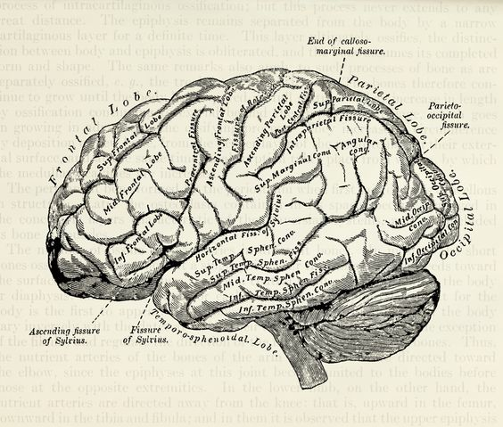

### my academic and professional experience

#### Education
* **University of Illinois at Urbana-Champaign **						                       
  + Bachelor of Science in Psychology and Statistics
  + graduated on May 2020
* **Columbia University (current)**
  + Master of Biostatistics

#### Leadership Experience
* **NPO Conch Shell mental support** 
  + *Vice president & active member in mental support group *	
    - Establishing yearly goals for organizations for branch UIUC and UCSD, communicating yearly goals to each department to divide the task, and monitoring the progress through meetings along the year
    - Volunteering in online peer support eight hours per week, mainly responsible for replying to distressed students and providing empathetic listening and encouragement, directing four peer support training session
    - Leading the brand promoting team on campus, creating different projects for promoting NPO, supervising more than five projects per semester, and eventually increasing the follower from 10 to more than 1500

#### Lab Experience
* **Research Lab Assistant in Dolcos’ Lab** 
  + *Research Lab Assistant*
    - Setting up experiments, running participants using Matlab and eye tracking device, collecting & organizing data
    - Cleaning & Validating Data on Excel. Analyzing data by using the linear regression model and logistic regression on R. Revising experiments on Psychopy

    

### To see more information about me

- [github account](https://github.com/Jiaying-Ning/)
- Email:<jn2761@cumc.columbia.edu>
